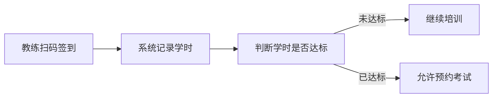
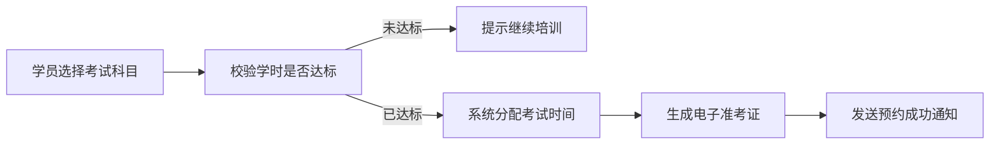

## 1. 产品概述

大型驾校学员培训与考试预约管理平台，支持学员、教练、考场管理员、财务和校长五种角色协同工作，实现从报名、培训、考试到退费的全流程数字化管理。

- **核心价值**：提升驾校运营效率，优化教练资源配置，提升学员体验，为校长提供数据决策支持
- **目标用户**：驾校学员、教练、考场管理员、财务人员、校长

## 2. 核心功能

### 2.1 用户角色

| 角色 | 登录方式 | 核心权限 |
|------|----------|----------|
| 学员 | 账号密码登录 | 在线报名、查看培训计划、扫码查询学时、预约考试、申请退费、查看消息 |
| 教练 | 账号密码登录 | 扫码签到、查看学员列表、查看累计课时、查看通过率统计、查看消息 |
| 考场管理员 | 账号密码登录 | 管理考场容量、查看考试预约、生成电子准考证、查看消息 |
| 财务 | 账号密码登录 | 审批退费申请、查看退费记录、自动打款、查看消息 |
| 校长 | 账号密码登录 | 查看多维报表、查看运营日报、查看消息通知 |

### 2.2 功能模块

1. **登录认证模块**：角色选择登录、身份验证
2. **学员端**：在线报名、培训计划、学时查询、考试预约、退费申请、消息中心
3. **教练端**：扫码签到、学员管理、课时统计、通过率统计、消息中心
4. **考场管理员端**：考场管理、考试预约管理、电子准考证、消息中心
5. **财务端**：退费审批、退费记录、财务统计、消息中心
6. **校长端**：数据报表、运营日报、消息中心
7. **智能匹配系统**：教练自动匹配、考试时间自动分配
8. **消息通知系统**：实时消息推送、凭证下载

### 2.3 页面详情

| 页面名称 | 模块名称 | 功能描述 |
|----------|----------|----------|
| 登录页 | 角色选择 | 选择五种角色之一进行登录 |
| 登录页 | 登录表单 | 账号密码登录、记住登录状态 |
| 学员首页 | 数据概览 | 培训进度、已完成学时、待考科目、消息提醒 |
| 学员首页 | 快捷入口 | 报名、预约考试、申请退费 |
| 报名页面 | 信息填写 | 个人信息、选择车型、选择空闲时段 |
| 报名页面 | 教练匹配 | 系统自动匹配最优教练、展示教练信息 |
| 培训计划页 | 计划列表 | 展示培训课程安排、上课时间、教练信息 |
| 学时查询页 | 学时统计 | 各科目已完成学时、剩余学时、进度条展示 |
| 考试预约页 | 科目选择 | 选择考试科目、查看可预约时间 |
| 考试预约页 | 预约确认 | 确认预约信息、生成电子准考证 |
| 退费申请页 | 退费计算 | 根据已培训学时自动计算退款金额 |
| 退费申请页 | 申请提交 | 填写退费原因、提交申请 |
| 消息中心 | 消息列表 | 分类展示系统消息、通知消息 |
| 消息中心 | 消息详情 | 查看消息详情、下载凭证 |
| 教练首页 | 数据概览 | 今日课时、累计课时、学员人数、通过率 |
| 扫码签到页 | 扫码功能 | 扫描二维码完成签到 |
| 学员管理页 | 学员列表 | 查看所教学员、培训进度 |
| 统计报表页 | 课时统计 | 按日/周/月统计课时 |
| 统计报表页 | 通过率统计 | 各科目学员考试通过率 |
| 考场首页 | 考场概览 | 今日考试人数、考场容量、待确认预约 |
| 考场管理页 | 考场列表 | 管理各考场信息、容量设置 |
| 考试预约管理页 | 预约列表 | 审核预约、分配考场、生成准考证 |
| 财务首页 | 财务概览 | 待审批退费、本月退费金额、财务趋势 |
| 退费审批页 | 审批列表 | 审核退费申请、查看详情 |
| 校长首页 | 数据总览 | 关键指标卡片、趋势图表 |
| 数据报表页 | 教练对比 | 各教练培训合格率、学员退费率多维对比 |
| 数据报表页 | 考试分析 | 各科目考试通过率趋势 |
| 运营日报页 | 日报列表 | 查看每日运营数据日报 |

## 3. 核心流程

### 3.1 学员报名与教练匹配流程

学员填写报名信息（个人信息、车型、空闲时段）→ 系统根据学员空闲时段和教练当前负荷自动匹配最优教练 → 生成培训计划 → 发送报名成功通知

### 3.2 培训与学时记录流程

教练扫码签到 → 系统自动记录培训学时 → 学时达标判定 → 达标后允许预约考试

### 3.3 考试预约流程

学员选择考试科目 → 系统检查学时是否达标 → 根据考场实时容量自动分配考试时间 → 生成电子准考证 → 发送预约成功通知

### 3.4 退费申请流程

学员发起退费申请 → 系统根据已培训学时比例自动计算应退金额 → 推送财务审批 → 审批通过后自动打款 → 发送退费完成通知

### 3.5 运营日报生成流程

每天凌晨自动统计 → 前一日培训总学时、考试预约人数、退费申请量 → 生成运营日报 → 推送到校长手机端

## 4. 用户界面设计

### 4.1 设计风格

- **设计定位**：专业、高效、现代化的企业级管理平台
- **主色调**：深蓝色系（#1e40af / #3b82f6）— 传达专业、可信赖
- **辅助色**：
  - 成功/通过：翠绿色（#10b981）
  - 警告/待处理：琥珀色（#f59e0b）
  - 错误/拒绝：玫红色（#ef4444）
  - 信息/通知：天蓝色（#0ea5e9）
- **中性色**：深灰（#1f2937）、中灰（#6b7280）、浅灰（#f3f4f6）、白色（#ffffff）
- **按钮风格**：圆角 8px，主按钮蓝色渐变，悬停有微妙阴影和亮度变化
- **字体**：
  - 标题：思源黑体 / Noto Sans SC，粗体，清晰有力
  - 正文：系统默认无衬线字体，中等字重，易读性优先
  - 数据数字：等宽数字，便于对比
- **布局风格**：
  - 左侧导航栏 + 顶部状态栏 + 主内容区的经典管理后台布局
  - 卡片式内容模块，圆角 12px，柔和阴影
  - 数据看板使用网格布局，指标卡片整齐排列
- **图标风格**：Lucide 线性图标，统一 24px 尺寸，与文字对齐

### 4.2 页面设计概述

| 页面名称 | 模块名称 | UI 元素 |
|----------|----------|---------|
| 登录页 | 登录卡片 | 左侧品牌展示区（渐变背景 + 驾校插画），右侧白色登录卡片，角色选择标签页，表单输入框，登录按钮 |
| 学员首页 | 数据概览 | 顶部欢迎语 + 消息提醒图标；四个数据卡片（培训进度、已完成学时、待考科目、未读消息）；快捷操作按钮组；培训计划时间线 |
| 报名页面 | 报名表单 | 分步向导式表单（个人信息 → 车型选择 → 时段选择 → 确认匹配），进度指示器，教练匹配结果卡片 |
| 考试预约页 | 预约表单 | 科目选择标签页，可预约日期日历，时段选择列表，预约确认弹窗，电子准考证预览 |
| 消息中心 | 消息列表 | 左侧分类标签（全部/系统通知/考试提醒/退费通知），右侧消息列表，未读红点标记，消息详情抽屉 |
| 教练首页 | 数据看板 | 顶部今日数据卡片，学员进度列表，扫码签到大按钮，周课时统计图表 |
| 校长首页 | 数据总览 | 顶部关键指标大盘（总学员数、在培人数、本月考试人次、退费率），趋势折线图，教练排行柱状图，最新日报卡片 |
| 数据报表页 | 对比图表 | 多维度筛选器，柱状对比图，折线趋势图，数据表格，导出按钮 |

### 4.3 响应式

- 采用桌面端优先设计（Desktop-first）
- 支持平板端适配，导航栏可折叠
- 关键页面支持移动端查看（数据看板、消息中心）
- 触屏交互优化，按钮最小点击区域 44px

### 4.4 动效与交互

- 页面切换：淡入淡出 + 轻微上移动画，200ms 缓动
- 数据加载：骨架屏占位，内容渐入
- 卡片悬停：微妙阴影加深 + 轻微上移（ translateY -2px ）
- 按钮交互：点击缩放 97%，过渡 150ms
- 消息通知：右上角滑入提示，3 秒后自动消失
- 图表数据：数字从 0 滚动到目标值的动画效果
