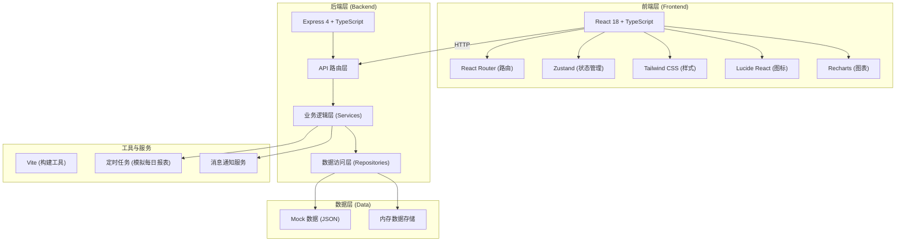
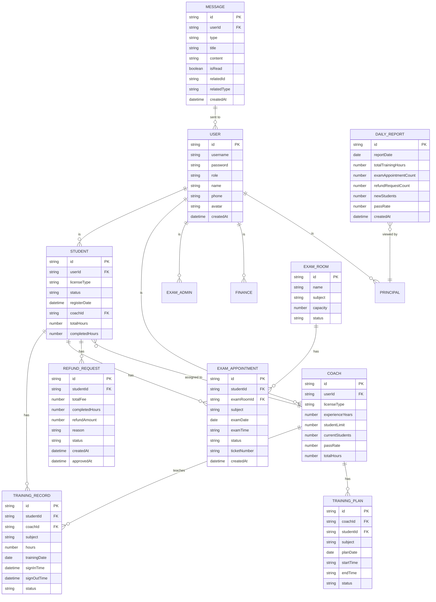

## 1. 架构设计



## 2. 技术描述

- **前端框架**：React@18 + TypeScript
- **构建工具**：Vite@5
- **路由管理**：react-router-dom@6
- **状态管理**：zustand@4
- **样式方案**：tailwindcss@3
- **图标库**：lucide-react
- **图表库**：recharts
- **后端框架**：Express@4 + TypeScript
- **数据存储**：Mock 数据 + 内存存储（便于演示）
- **初始化模板**：react-express-ts

## 3. 路由定义

### 前端路由

| 路由路径 | 页面 | 角色 | 说明 |
|----------|------|------|------|
| /login | 登录页 | 所有 | 角色选择 + 登录表单 |
| /student/dashboard | 学员首页 | 学员 | 数据概览 + 快捷入口 |
| /student/register | 在线报名 | 学员 | 分步报名 + 教练匹配 |
| /student/training | 培训计划 | 学员 | 培训课程安排列表 |
| /student/hours | 学时查询 | 学员 | 各科目学时统计 |
| /student/exam | 考试预约 | 学员 | 科目选择 + 时间预约 |
| /student/refund | 退费申请 | 学员 | 退费计算 + 申请提交 |
| /student/messages | 消息中心 | 学员 | 消息列表 + 详情 |
| /coach/dashboard | 教练首页 | 教练 | 数据概览 + 快捷入口 |
| /coach/signin | 扫码签到 | 教练 | 二维码扫描签到 |
| /coach/students | 学员管理 | 教练 | 学员列表 + 培训进度 |
| /coach/statistics | 统计报表 | 教练 | 课时 + 通过率统计 |
| /coach/messages | 消息中心 | 教练 | 消息列表 + 详情 |
| /exam/dashboard | 考场首页 | 考场管理员 | 考场概览 |
| /exam/rooms | 考场管理 | 考场管理员 | 考场信息 + 容量设置 |
| /exam/appointments | 预约管理 | 考场管理员 | 考试预约审核 |
| /exam/messages | 消息中心 | 考场管理员 | 消息列表 + 详情 |
| /finance/dashboard | 财务首页 | 财务 | 财务概览 |
| /finance/refunds | 退费审批 | 财务 | 退费申请审批 |
| /finance/messages | 消息中心 | 财务 | 消息列表 + 详情 |
| /principal/dashboard | 校长首页 | 校长 | 数据总览 |
| /principal/reports | 数据报表 | 校长 | 多维对比报表 |
| /principal/daily | 运营日报 | 校长 | 每日运营数据 |
| /principal/messages | 消息中心 | 校长 | 消息列表 + 详情 |

### 后端 API 路由

| 方法 | 路径 | 说明 |
|------|------|------|
| POST | /api/auth/login | 用户登录 |
| GET | /api/auth/profile | 获取当前用户信息 |
| POST | /api/students/register | 学员报名 |
| GET | /api/students/:id | 获取学员详情 |
| GET | /api/coaches | 获取教练列表 |
| GET | /api/coaches/:id/students | 获取教练的学员列表 |
| POST | /api/training/signin | 教练扫码签到 |
| GET | /api/training/hours/:studentId | 获取学员学时 |
| GET | /api/exam/rooms | 获取考场列表 |
| GET | /api/exam/appointments | 获取考试预约列表 |
| POST | /api/exam/appointments | 创建考试预约 |
| PUT | /api/exam/appointments/:id | 更新考试预约状态 |
| GET | /api/refunds | 获取退费申请列表 |
| POST | /api/refunds | 提交退费申请 |
| PUT | /api/refunds/:id/approve | 审批退费申请 |
| GET | /api/messages | 获取消息列表 |
| PUT | /api/messages/:id/read | 标记消息已读 |
| GET | /api/reports/overview | 获取总览数据 |
| GET | /api/reports/coach-comparison | 教练对比数据 |
| GET | /api/reports/daily | 获取运营日报 |

## 4. 数据模型

### 4.1 数据模型定义



### 4.2 核心类型定义

```typescript
// 用户角色
type UserRole = 'student' | 'coach' | 'exam_admin' | 'finance' | 'principal';

// 用户
interface User {
  id: string;
  username: string;
  role: UserRole;
  name: string;
  phone: string;
  avatar?: string;
  createdAt: string;
}

// 学员
interface Student {
  id: string;
  userId: string;
  licenseType: string;
  status: 'studying' | 'graduated' | 'refunded';
  registerDate: string;
  coachId: string;
  totalHours: number;
  completedHours: number;
}

// 教练
interface Coach {
  id: string;
  userId: string;
  licenseType: string;
  experienceYears: number;
  studentLimit: number;
  currentStudents: number;
  passRate: number;
  totalHours: number;
}

// 培训记录
interface TrainingRecord {
  id: string;
  studentId: string;
  coachId: string;
  subject: string;
  hours: number;
  trainingDate: string;
  signInTime: string;
  signOutTime?: string;
  status: 'in_progress' | 'completed';
}

// 考试预约
interface ExamAppointment {
  id: string;
  studentId: string;
  examRoomId: string;
  subject: string;
  examDate: string;
  examTime: string;
  status: 'pending' | 'confirmed' | 'completed' | 'cancelled';
  ticketNumber: string;
  createdAt: string;
}

// 退费申请
interface RefundRequest {
  id: string;
  studentId: string;
  totalFee: number;
  completedHours: number;
  refundAmount: number;
  reason: string;
  status: 'pending' | 'approved' | 'rejected';
  createdAt: string;
  approvedAt?: string;
}

// 消息
interface Message {
  id: string;
  userId: string;
  type: 'system' | 'exam' | 'refund' | 'training';
  title: string;
  content: string;
  isRead: boolean;
  relatedId?: string;
  relatedType?: string;
  createdAt: string;
}

// 每日报表
interface DailyReport {
  id: string;
  reportDate: string;
  totalTrainingHours: number;
  examAppointmentCount: number;
  refundRequestCount: number;
  newStudents: number;
  passRate: number;
  createdAt: string;
}
```

## 5. 项目结构

```
├── src/                      # 前端代码
│   ├── components/           # 公共组件
│   │   ├── Layout/           # 布局组件
│   │   ├── Card/             # 卡片组件
│   │   ├── Chart/            # 图表组件
│   │   ├── Table/            # 表格组件
│   │   └── MessageToast/     # 消息提示
│   ├── pages/                # 页面组件
│   │   ├── Login/            # 登录页
│   │   ├── Student/          # 学员端页面
│   │   ├── Coach/            # 教练端页面
│   │   ├── Exam/             # 考场管理员页面
│   │   ├── Finance/          # 财务端页面
│   │   └── Principal/        # 校长端页面
│   ├── hooks/                # 自定义 Hooks
│   ├── store/                # Zustand 状态管理
│   ├── utils/                # 工具函数
│   ├── types/                # TypeScript 类型定义
│   ├── App.tsx
│   └── main.tsx
├── api/                      # 后端代码
│   ├── routes/               # API 路由
│   ├── services/             # 业务逻辑
│   ├── data/                 # Mock 数据
│   ├── middleware/           # 中间件
│   └── index.ts
├── shared/                   # 共享类型
│   └── types.ts
├── vite.config.ts
├── tailwind.config.js
└── package.json
```
